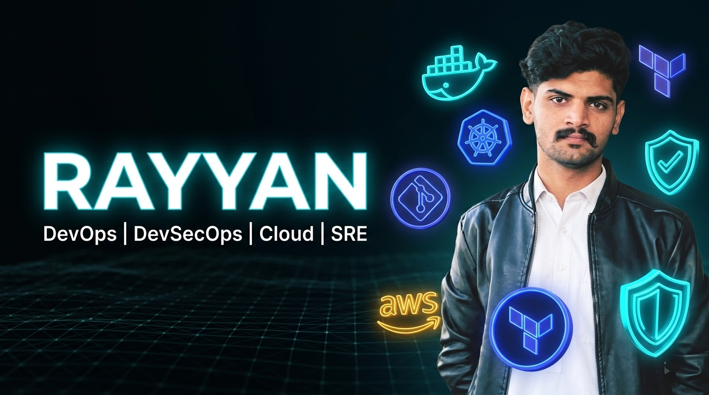

  <!-- Header Banner -->
  

    

  <!-- Header Animated Greeting -->
  <h1>💫 Hi, I'm Rayyan</h1>
  <h3>🚀 DevOps | DevSecOps | Cloud | SRE Specialist</h3>

  

    
  

  <!-- Social Badges -->
  

    
    
    
  

  

    
  

---

### 📖 About Me

I am a **DevOps & DevSecOps Engineer** dedicated to building **reliable**, **secure**, and **automated** cloud infrastructure. Experienced in delivering production-ready environments through automated CI/CD pipelines, containerization, Infrastructure as Code, and continuous security scanning.

> *"Automate everything. Secure by default. Keep systems reliable."*

---

### <table>
  <tr>
    <td width="50%" valign="top">
      <h3>⚡ Core Competencies & Skills</h3>
      <ul>
        <li>🐧 <b>Linux Administration</b></li>
        <li>🌿 <b>Git & GitHub Automation</b></li>
        <li>🐳 <b>Docker & Containerization</b></li>
        <li>☁️ <b>AWS & Multi-Cloud Architecture</b></li>
        <li>⚙️ <b>CI/CD Pipelines (GitHub Actions)</b></li>
        <li>🛡️ <b>DevSecOps & Automated Security Scanning</b></li>
        <li>📜 <b>Bash & Python Automation</b></li>
        <li>📦 <b>Infrastructure as Code (Terraform)</b></li>
        <li>📊 <b>Monitoring & Observability (Prometheus & Grafana)</b></li>
        <li>🌐 <b>Networking & Web Server Management (Nginx/Apache)</b></li>
      </ul>
    </td>
    <td width="50%" valign="top">
      <h3>🚀 Engineering Focus & Highlights</h3>
      <ul>
        <li>🏗️ <b>Production-Ready Infrastructure:</b> Architecting scalable, highly available cloud systems.</li>
        <li>☸️ <b>Container Orchestration:</b> Managing containerized applications with Docker & Kubernetes.</li>
        <li>🛡️ <b>Shift-Left Security:</b> Embedding automated static analysis & vulnerability scanning into CI/CD workflows.</li>
        <li>📜 <b>Automation & IaC:</b> Deploying reproducible environments using Terraform & Ansible.</li>
        <li>🤝 <b>Open for Opportunities:</b> Available for DevOps, DevSecOps, SRE, and Cloud Engineering roles.</li>
      </ul>
    </td>
  </tr>
</table>

---

### 💻 Tech Stack

#### ☁️ Cloud & Hosting Platform

  
  
  
  
  
  
  

#### 🐳 DevOps, Containers & IaC

  
  
  
  
  
  
  

#### 🛡️ DevSecOps & Security Tools

  
  
  
  
  
  
  

#### 📊 Monitoring & Observability

  
  

#### 📜 Languages & Frameworks

  
  
  
  
  
  

#### 🗄️ Databases & BaaS

  
  
  
  
  

#### 🛠️ OS, Tools & Collaboration

  
  
  
  
  
  
  
  

---

### 📊 GitHub Dashboard

  
  

 

  

 

  <h3>🏆 GitHub Trophies</h3>
  

 

  <h3>🔝 Top Contributed Repositories</h3>
  

 

  

---

  
⚡ Crafted with passion for automation and security by <b>Rayyan</b>

